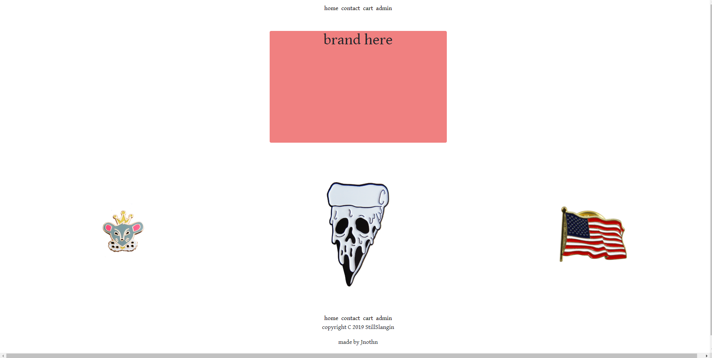
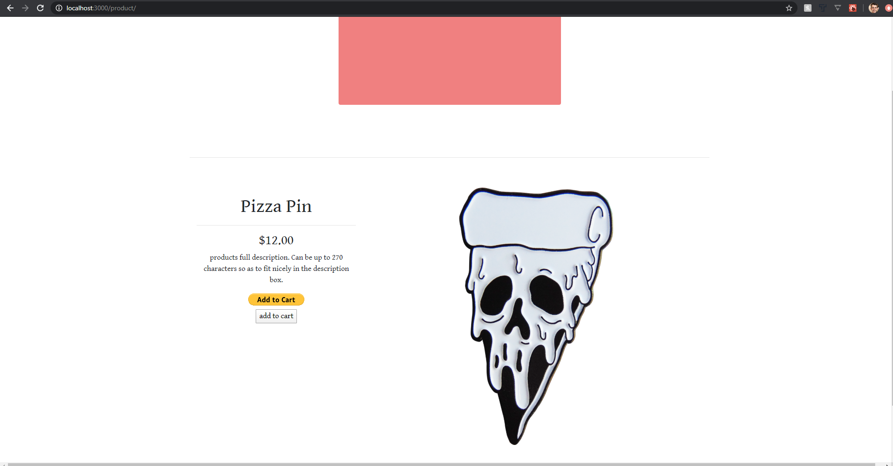
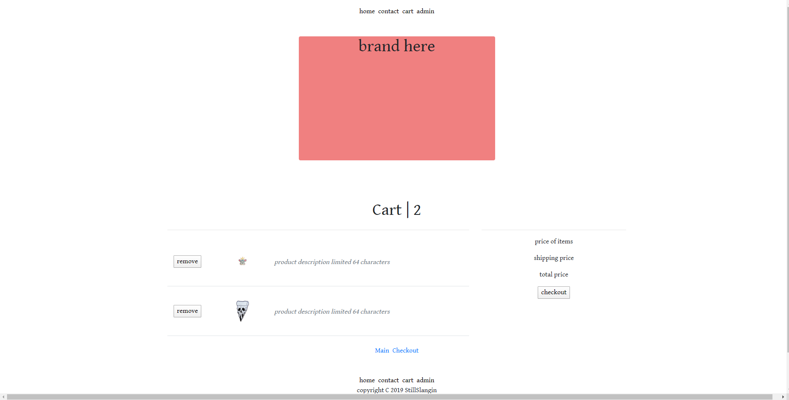
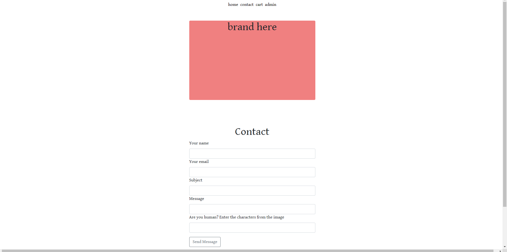
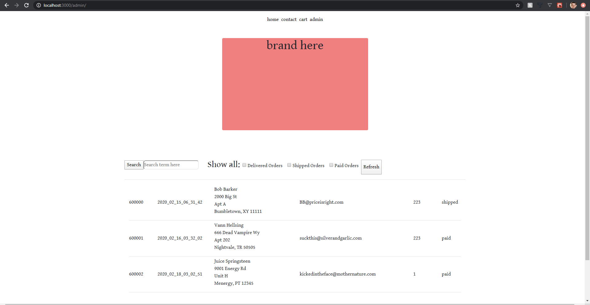

# ecommerce-store

See the link below for the website we're trying to emulate.

https://www.rollthevice.com/

## Screenshots

### _Main_

### _Product View_

### _Cart View_

### _Contact Page_

### _Admin Page_

## Functions
  * Allow customers to browse catalog of enamel pins
  * Allow customers to build and save a cart of items before checking out
  * Checkout and process payments utilizing Paypal {WIP}
  * Allow customers to contact owner with questions/comments/concerns/etc
  * Allow admin to easily view current and past orders to ensure fulfillment of purchases
  
## Post-Launch Features Goals
  * Allow owner to easily upload new pin images and create new store entries
  * Create timed reminders for orders unfulfilled within certain time frames
  * Explore efficiency of database vs client side hosting, particularly of product details
  
## Technologies Used

### Languages
  * HTML
  * CSS
  * Javascript
  * React (Create-React-App)
  * Express
  * Node
  
## Authorship
  *Seth Marquardt
